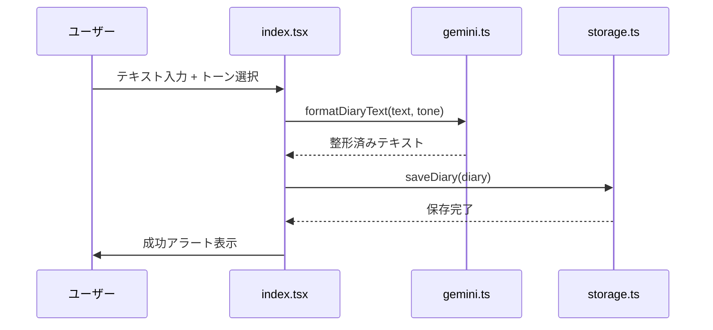

# 📖 てきとー日記 (Tekito Diary)

「今日あったこと」を適当に書くだけで、AIが綺麗な日記に整形してくれるスマホアプリ。

---

## ✨ 主な機能

| 機能 | 説明 |
|---|---|
| **フリーテキスト入力** | 箇条書きやメモ書きなど、自由な形式で「今日あったこと」を入力 |
| **AI整形 (Gemini)** | 入力テキストをGemini APIで自然な日記文体に自動変換 |
| **トーン選択** | 「事実（綺麗に）」と「Z世代（フランク）」の2種類から出力スタイルを選択 |
| **ローカル保存** | 整形された日記をAsyncStorageでデバイス内に永続保存 |
| **履歴閲覧** | 過去に保存した日記を一覧画面で確認 |
| **リマインド通知** | 毎日0時にローカル通知で日記の記入をリマインド |

---

## 🛠️ 技術スタック

| カテゴリ | 技術 |
|---|---|
| フレームワーク | React Native (Expo SDK 54) |
| 言語 | TypeScript |
| ルーティング | Expo Router (ファイルベース) |
| AI API | Google Gemini 1.5 Pro (`@google/generative-ai`) |
| ローカル保存 | `@react-native-async-storage/async-storage` |
| プッシュ通知 | `expo-notifications` (ローカル通知) |
| アイコン | `lucide-react-native` |

---

## 📁 ディレクトリ構成

```
tekito_diary/
├── app/                          # Expo Router 画面定義
│   ├── _layout.tsx               # ルートレイアウト (Stack + 通知初期化)
│   ├── index.tsx                 # ホーム画面 (入力 → AI変換 → 保存)
│   └── history.tsx               # 過去の日記一覧画面
├── components/                   # 再利用UIコンポーネント
│   ├── ToneSelector.tsx          # トーン選択トグル
│   └── DiaryCard.tsx             # 日記表示カード
├── services/                     # ビジネスロジック層
│   ├── gemini.ts                 # Gemini API連携・プロンプト構築
│   ├── storage.ts                # AsyncStorage CRUD操作
│   └── notification.ts           # ローカル通知のセットアップ
├── .env                          # 環境変数 (APIキー)
├── app.json                      # Expo設定
├── package.json                  # npm設定・依存パッケージ
└── tsconfig.json                 # TypeScript設定
```

---

## 🚀 環境構築・セットアップ

### 前提条件

- **Node.js** v20以上
- **npm** (Node.jsに同梱) または **yarn**
- **Expo Go アプリ** (実機テスト用：[iOS](https://apps.apple.com/app/expo-go/id982107779) / [Android](https://play.google.com/store/apps/details?id=host.exp.exponent))
- **Google Gemini APIキー** ([Google AI Studio](https://aistudio.google.com/apikey) で取得)

### 手順

#### 1. リポジトリのクローンと依存パッケージのインストール

```bash
git clone https://github.com/your-username/tekito_diary.git
cd tekito_diary
npm install
```

#### 2. 環境変数の設定

プロジェクトルートの `.env` ファイルを開き、取得したGemini APIキーを設定します。

```env
EXPO_PUBLIC_GEMINI_API_KEY=ここにあなたのAPIキーを貼り付け
```

> [!CAUTION]
> `.env` ファイルは `.gitignore` に含まれています。APIキーを絶対にGitにコミットしないでください。

#### 3. 開発サーバーの起動

```bash
npx expo start
```

起動後、以下のいずれかの方法でアプリを開きます：

| 方法 | 操作 |
|---|---|
| **実機 (推奨)** | 表示されるQRコードをExpo Goアプリでスキャン |
| **iOS Simulator** | ターミナルで `i` キーを押下 |
| **Android Emulator** | ターミナルで `a` キーを押下 |

> [!NOTE]
> ローカル通知機能は **実機でのみ** 動作します。Simulatorでは通知のテストができません。

---

## 🏗️ アーキテクチャ設計

### レイヤー構成

```
  画面 (app/)  →  コンポーネント (components/)  →  サービス (services/)
```

- **画面層 (`app/`)**: ユーザー操作を受け付け、サービス層を呼び出す
- **コンポーネント層 (`components/`)**: 再利用可能なUI部品。状態を持たず、propsで制御
- **サービス層 (`services/`)**: 外部API通信・データ永続化・通知スケジューリングなどの純粋ロジック

### データフロー



### データモデル (`Diary`)

```typescript
interface Diary {
  id: string;           // ユニークID (Date.now())
  date: string;         // 表示用日付 (ja-JP形式)
  originalText: string; // ユーザーの元テキスト
  formattedText: string;// AI整形後のテキスト
  tone: 'fact' | 'genz';// 選択トーン
  timestamp: number;    // ソート用タイムスタンプ
}
```

---

## 📝 各ファイルの役割

### `services/gemini.ts`
Gemini 1.5 Pro に対してトーン別のプロンプトを送信し、整形された日記テキストを返却する。APIキー未設定時はエラーを投げる安全設計。

### `services/storage.ts`
AsyncStorageを使い、日記のCRUD操作を提供。新しい日記は配列の先頭に挿入され、最新順で保存される。

### `services/notification.ts`
アプリ起動時に通知権限を取得し、毎日0:00にリマインド通知をスケジュール。Android用の通知チャンネル設定も実装済み。

### `components/ToneSelector.tsx`
iOS風セグメントコントロールUIで2つのトーンを切り替えるトグル。

### `components/DiaryCard.tsx`
履歴画面で各日記を表示するカード。トーンバッジ、整形テキスト、元メモの折りたたみ表示を含む。

---

## 🔧 今後の拡張案

- [ ] 日記の削除・編集機能
- [ ] カレンダーUIからの日付別閲覧
- [ ] ダークモード対応
- [ ] AsyncStorage → SQLite への移行（データ量増加対策）
- [ ] アプリアイコン・スプラッシュ画面のカスタマイズ
